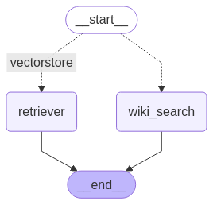

# 🤖 Multi-AI Agent Chatbot using ASTRA DB

This project builds a **multi-agent chatbot system** capable of intelligently handling user queries by **routing** them to the right information source using **LangGraph** and **ASTRA DB**.

The system is designed to:

- Use **Astra DB** (powered by **Apache Cassandra**) as a **vectorstore** for storing embeddings
- **Route user queries** intelligently between:
  - A **Wikipedia Search** agent
  - A **Vectorstore agent** (containing embeddings from specific blog URLs)
- **Visualize agent flow** using **LangGraph** to represent start-to-end decision paths.

---

## 📚 URLs used for Embedding

The system embeds the following important blog posts into the vector database:

- [Demystifying AI Agents](https://lilianweng.github.io/posts/2023-06-23-agent/)
- [Prompt Engineering Techniques](https://lilianweng.github.io/posts/2023-03-15-prompt-engineering/)
- [Adversarial Attacks on LLMs](https://lilianweng.github.io/posts/2023-10-25-adv-attack-llm/)

These form the knowledge base for answering specialized technical questions.

---

## ⚡ Tech Stack

- **LangChain** — for agent creation and routing logic
- **ASTRA DB (Cassandra)** — as a Vectorstore for embeddings
- **LangGraph** — for building a visual graph of the agent decision flow
- **Wikipedia API** — for real-time search when queries are general

---

## 🚀 How to Setup and Run the Project

Follow these simple steps to run the Multi-AI Agent Chatbot:

---

### ✅ Step 1: Create and Activate a Conda Environment

**Functionality**:  
Create a clean Python environment to avoid conflicts with other libraries.

```bash
conda create -n langgraph_chatbot_env python=3.11 -y
conda activate langgraph_chatbot_env
```
---

```bash
pip install -r requirements.txt
```
---
<p align="center">
  
</p>
---